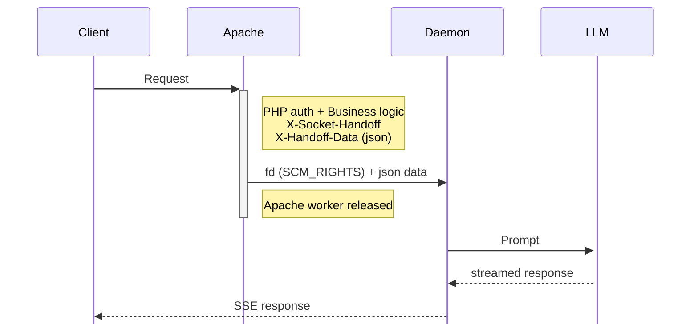

# mod_socket_handoff

Apache module that provides X-Accel-Redirect style socket handoff.

Allows PHP (or any handler) to authenticate a request and then hand off the
client connection to an external daemon for streaming responses. The Apache
worker is freed immediately after handoff.

## Credits

This module borrows code and concepts from:

- **[mod_proxy_fdpass](https://httpd.apache.org/docs/2.4/mod/mod_proxy_fdpass.html)** -
  The dummy socket swap trick that prevents Apache from closing the real client
  socket when the request completes. This is the key mechanism that allows the
  external daemon to take ownership of the connection.

- **[mod_xsendfile](https://tn123.org/mod_xsendfile/)** -
  The output filter pattern for intercepting response headers after the handler
  (PHP) has run. This allows the handoff decision to be made based on headers
  set by the application.

## Use Case

Streaming LLM responses:
1. Client sends request to Apache
2. PHP authenticates user, prepares request parameters
3. PHP sets `X-Socket-Handoff` header and exits
4. This module passes the client socket to a streaming daemon
5. Apache worker is freed immediately
6. Streaming daemon sends response directly to client

## How It Works



## Build

```bash
make
sudo make install
```

## Configure

### Debian/Ubuntu

```bash
make enable
sudo systemctl reload apache2
```

### Manual

Add to Apache config:

```apache
LoadModule socket_handoff_module modules/mod_socket_handoff.so

SocketHandoffEnabled On
SocketHandoffAllowedPrefix /var/run/
SocketHandoffConnectTimeoutMs 500
```

## Configuration Directives

### SocketHandoffEnabled

Enable or disable the filter.

```apache
SocketHandoffEnabled On|Off
```

Default: `On`

### SocketHandoffAllowedPrefix

Security setting: only allow socket paths under this prefix.

```apache
SocketHandoffAllowedPrefix /var/run/
```

Default: `/var/run/`

### SocketHandoffConnectTimeoutMs

Timeout (in milliseconds) when connecting to the handoff daemon Unix socket.
Valid range: 1-60000 (1ms to 60 seconds).

```apache
SocketHandoffConnectTimeoutMs 500
```

Default: `500`

## PHP Usage

```php
<?php
// Authenticate user
$user = authenticate();

// Prepare handoff data
$data = json_encode([
    'user_id' => $user->getId(),
    'prompt' => $_POST['prompt'],
    'model' => 'gpt-4',
]);

// Tell Apache to hand off to streaming daemon
header('X-Socket-Handoff: /var/run/streaming-daemon.sock');
header('X-Handoff-Data: ' . $data);

// Exit immediately - module takes over
exit;
```

## Streaming Daemon

The daemon must:
1. Listen on a Unix socket
2. Receive client fd via `recvmsg()` with `SCM_RIGHTS`
3. Read the handoff data
4. Send HTTP response to the client fd
5. Close the fd when done

See `examples/` for implementations in:
- **fdrecv** (`fdrecv.c`) - Minimal C daemon that execs any handler with fd as stdin/stdout
- Go (`streaming-daemon-go/`) - Goroutines with HTTP/2 multiplexing, Prometheus metrics
- Rust (`streaming-daemon-rs/`) - Async/await with Tokio, HTTP/2 with flow control tuning, Prometheus metrics
- PHP AMPHP (`streaming-daemon-amp/`) - Fibers with HTTP/2 via amphp/http-client
- PHP Swoole (`streaming-daemon-swoole/`) - Native coroutines with HTTP/2 client
- PHP Swow (`streaming-daemon-swow/`) - Coroutines with curl_multi HTTP/2 multiplexing
- Python (`streaming_daemon_async.py`) - asyncio with optional HTTP/2 via PycURL
- C io_uring (`streaming-daemon-uring/`) - Linux io_uring with curl_multi

### Using fdrecv

The simplest option - use any program as a handler:

```bash
# Build
cc -o fdrecv examples/fdrecv.c

# Run with shell script
fdrecv /var/run/streaming-daemon.sock ./handler.sh

# Run with PHP
fdrecv /var/run/streaming-daemon.sock php handler.php

# Run with any command
fdrecv /var/run/streaming-daemon.sock python3 handler.py
```

The handler receives:
- stdin/stdout connected to the client socket
- `HANDOFF_DATA` environment variable with the JSON data from PHP

Example with figlet:
```bash
fdrecv /var/run/streaming-daemon.sock ./figlet_handler.sh

curl "http://localhost/api/stream?prompt=Hello+World"
#  _   _      _ _        __        __         _     _
# | | | | ___| | | ___   \ \      / /__  _ __| | __| |
# | |_| |/ _ \ | |/ _ \   \ \ /\ / / _ \| '__| |/ _` |
# |  _  |  __/ | | (_) |   \ V  V / (_) | |  | | (_| |
# |_| |_|\___|_|_|\___/     \_/\_/ \___/|_|  |_|\__,_|
```

## Frontend Integration

This section explains how to build a complete frontend that triggers the handoff
from PHP and streams the response into your UI with JavaScript.

### PHP: Triggering the Handoff

Your PHP endpoint authenticates the user, prepares the request data, and sets
the handoff headers. The module intercepts these headers and passes the client
connection to the daemon.

```php
<?php
// api/stream.php

declare(strict_types=1);

// 1. Authenticate the request
session_start();
if (!isset($_SESSION['user_id'])) {
    http_response_code(401);
    header('Content-Type: application/json');
    exit(json_encode(['error' => 'Unauthorized']));
}

// 2. Validate input
$prompt = trim($_POST['prompt'] ?? '');
if ($prompt === '') {
    http_response_code(400);
    header('Content-Type: application/json');
    exit(json_encode(['error' => 'Prompt required']));
}

// 3. Prepare handoff data (this is sent to the daemon)
$handoff_data = json_encode([
    'user_id' => $_SESSION['user_id'],
    'prompt' => $prompt,
    'model' => $_POST['model'] ?? 'gpt-4o',
    'request_id' => uniqid('req_', true),
]);

// 4. Set handoff headers
header('X-Socket-Handoff: /var/run/streaming-daemon.sock');
header('X-Handoff-Data: ' . $handoff_data);

// 5. Exit - mod_socket_handoff takes over
// The Apache worker is freed immediately. The daemon now owns
// the connection and will stream the response directly to the client.
exit;
```

### JavaScript: Consuming the SSE Stream

The daemon responds with Server-Sent Events (SSE). Use the `EventSource` API
or `fetch()` with a reader to consume the stream.

#### Using EventSource (GET requests)

The simplest approach for GET requests:

```javascript
function streamResponse(prompt) {
    const output = document.getElementById('output');
    output.textContent = '';

    // EventSource only supports GET, so pass prompt in query string
    const url = `/api/stream.php?prompt=${encodeURIComponent(prompt)}`;
    const source = new EventSource(url);

    source.onmessage = (event) => {
        // Each message contains a chunk of the response
        output.textContent += event.data;
    };

    source.addEventListener('done', () => {
        // Custom event sent by daemon when stream is complete
        source.close();
    });

    source.onerror = (event) => {
        source.close();
        if (output.textContent === '') {
            output.textContent = 'Connection error. Please try again.';
        }
    };
}
```

#### Using fetch() (POST requests)

For POST requests with a body, use `fetch()` with a stream reader:

```javascript
async function streamResponse(prompt) {
    const output = document.getElementById('output');
    output.textContent = '';

    const response = await fetch('/api/stream.php', {
        method: 'POST',
        headers: { 'Content-Type': 'application/x-www-form-urlencoded' },
        body: `prompt=${encodeURIComponent(prompt)}`,
    });

    if (!response.ok) {
        const error = await response.json();
        output.textContent = error.error || 'Request failed';
        return;
    }

    const reader = response.body.getReader();
    const decoder = new TextDecoder();

    while (true) {
        const { done, value } = await reader.read();
        if (done) break;

        // Parse SSE format: "data: content\n\n"
        const text = decoder.decode(value);
        const lines = text.split('\n');

        for (const line of lines) {
            if (line.startsWith('data: ')) {
                const data = line.slice(6);
                if (data === '[DONE]') break;
                output.textContent += data;
            }
        }
    }
}
```

### Complete HTML Example

```html
<!DOCTYPE html>
<html>
<head>
    <title>Streaming Demo</title>
    <style>
        #output {
            white-space: pre-wrap;
            font-family: monospace;
            background: #f5f5f5;
            padding: 1rem;
            min-height: 100px;
        }
    </style>
</head>
<body>
    <form id="chat-form">
        <input type="text" id="prompt" placeholder="Enter your prompt" required>
        <button type="submit">Send</button>
    </form>
    <div id="output"></div>

    <script>
    document.getElementById('chat-form').addEventListener('submit', async (e) => {
        e.preventDefault();

        const prompt = document.getElementById('prompt').value;
        const output = document.getElementById('output');
        output.textContent = '';

        try {
            const response = await fetch('/api/stream.php', {
                method: 'POST',
                headers: { 'Content-Type': 'application/x-www-form-urlencoded' },
                body: `prompt=${encodeURIComponent(prompt)}`,
            });

            if (!response.ok) throw new Error('Request failed');

            const reader = response.body.getReader();
            const decoder = new TextDecoder();

            while (true) {
                const { done, value } = await reader.read();
                if (done) break;

                const text = decoder.decode(value);
                for (const line of text.split('\n')) {
                    if (line.startsWith('data: ')) {
                        const data = line.slice(6);
                        if (data !== '[DONE]') {
                            output.textContent += data;
                        }
                    }
                }
            }
        } catch (err) {
            output.textContent = 'Error: ' + err.message;
        }
    });
    </script>
</body>
</html>
```

### SSE Format

The daemon sends responses in SSE format. Each chunk is prefixed with `data: `
and terminated with two newlines:

```
data: Hello
data: , how
data:  can
data:  I help?
data: [DONE]

```

Common conventions:
- `data: [DONE]` signals the stream is complete
- `event: error` can be used for error messages
- Empty `data:` lines are typically ignored by clients

## Headers

### X-Socket-Handoff (required)

Path to the Unix socket of the daemon.

```
X-Socket-Handoff: /var/run/streaming-daemon.sock
```

### X-Handoff-Data (optional)

Data to pass to the daemon (typically JSON).

```
X-Handoff-Data: {"user_id":123,"prompt":"Hello"}
```

## Security

- Socket paths are validated against `SocketHandoffAllowedPrefix`
- Path traversal attacks (`../`) are blocked via `realpath()` check
- Headers are removed before any response is sent to client
- Only works for main requests (not subrequests)

## Performance Tuning

For high-traffic deployments handling millions of requests, consider these
optimizations:

### Connect Timeout

The default timeout (500ms) is generous for localhost Unix socket connections.
If your daemon is consistently responsive, you can lower this:

```apache
SocketHandoffConnectTimeoutMs 100
```

A lower timeout means Apache workers fail fast if the daemon is unresponsive,
preventing worker starvation.

### Daemon Design

The streaming daemon should:

1. **Accept connections quickly** - Don't do heavy work before accept()
2. **Handle concurrent connections** - Use goroutines (Go), async I/O, or
   a process pool to handle multiple handoffs simultaneously
3. **Keep connections to the daemon** - The module creates a new Unix socket
   connection for each handoff. For extreme throughput, consider modifying
   the daemon to use persistent connections or SOCK_DGRAM

### Monitoring

Monitor handoff performance with:

```bash
# Check Apache error log for timeout messages
tail -f /var/log/apache2/error.log | grep socket_handoff

# Monitor daemon socket connections
watch -n1 'ss -x | grep streaming-daemon | wc -l'
```

## Limitations

1. **SSL/TLS**: The client fd is the raw socket. If Apache terminates SSL,
   the fd is the encrypted connection. The daemon would need the SSL context.
   **Workaround**: Terminate SSL at a load balancer.

2. **Keep-Alive**: After handoff, the connection is owned by the daemon.
   HTTP keep-alive for subsequent requests won't work.

3. **Logging**: Apache won't log the response (it handed off before responding).
   The daemon should log instead.

## License

Apache 2.0
